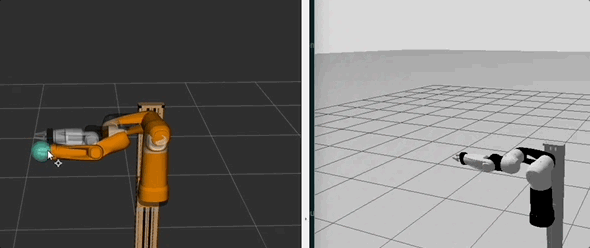
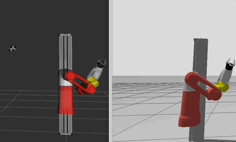
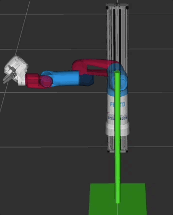

# Cobot

Development of imitation learning for articulated robots using a pneumatic cobot (provided by [**Festo SE & Co. KG**](https://www.festo.com/)).


## Getting Started

### 1. Build and run docker container

```
source /opt/ros/jazzy/setup.{bash/zsh} 
git clone --recurse-submodules https://github.com/robgineer/cobot.git .
cd cobot
./scripts/docker_configuration.sh
```

### 2. Build the project

In the docker container:
```
cd ~/cobot
colcon build --merge-install --symlink-install --cmake-args "-DCMAKE_BUILD_TYPE=Release"
source install/setup.{bash/zsh}
```

### 3. Run MoveIt2 Gazebo examples

#### Adapted MoveIt2 Demo for Cobot
```
export DISPLAY=:100 # or any display number you prefer that is not used
xpra start :100

ros2 launch cobot_moveit_config gz_demo_launch.py
```

On client run:
```
xpra attach ssh://<user>@<server>:22/100
```

This will open a gazebo / rviz GUI that allows the manipulation of the cobot.




To control the joints in gazebo and rviz manually run the ```rqt_joint_trajectory_controller``` in a separate terminal (don't forget to start an xpra session with a different display and connect to it from your client machine)
```
ros2 run rqt_joint_trajectory_controller rqt_joint_trajectory_controller
```

#### MoveIt2 Inverse Kinematic

Open second terminal on host machine and run
```
ros2 run demo simple_ik
```


Run same example without Gazebo (fake controllers only)

```
ros2 launch demo rviz_demo_launch.py
```

#### Pick and Place with MoveIt Task Constructor

```
ros2 launch demo rviz_demo_launch.py
```
```
ros2 launch demo pick_place_launch.py
```




## Dev. Container

The entire development environment is based on an Ubuntu 24.04 docker container.
This allows to migrate fast between host systems. In order to build the development environment, run the following scripts:

1. ```scripts/pre-installation.sh```: to run in case you are using a remote cloud server (such as AWS EC2) that requires the creation of a new user
2. ```scripts/docker_installation.sh```: to install docker on host system and to add current user to docker group (this script is obsolete on most cloud severs)
3. ```scripts/docker_configuration.sh```: to build and start the docker image that contains the development environment

### Start X11 Forwarding from Docker container

The docker container built will enable X11 forwarding to client machines. <br/>
Note: although SSH access to a docker container is (sometimes) referred to as an "anti-pattern" (apparently this implies treating the docker container like a VM), I still believe that this solution is the way-to-go for an environment that contains all required dependencies for the development of this project.

Start docker container as defined in ```scripts/docker_configuration.sh```

In the docker container run:
```
export DISPLAY=:100 # or any display number you prefer that is not used
xpra start :100
```

On client run:
```
xpra attach ssh://<user>@<server>:22/100
```
Where \<server\> represents the address of your remote host that runs the docker container. X11 will be forwarded from the remote host to the docker container.

All graphical user interfaces started from the terminal of the docker container will be forwarded to the client machine.

## License

SPDX-License-Identifier: BSD 3-Clause AND Apache-2.0
<br/>
<br/>
While this project is licensed under BSD 3-Clause, the robot model provided is licensed under Apache-2.0 (refer *src/cobot_model* for more details).
