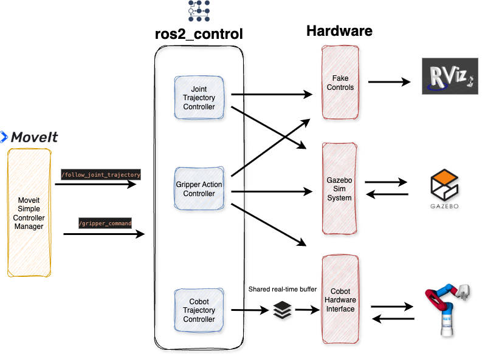

# MoveIt2 and ROS2 Control Configuration

We plan trajectories and gripper actions with MoveIt2 and execute them using ROS2 control.


MoveIt2 and ROS2 control contain several configuration files. These are located in the `cobot_moveit_config` directory. We will focus on the following files:
```
moveit_controllers.yaml / moveit_custom_controllers.yaml
ros2_controllers.yaml
kinematics.yaml
ompl_planning.yaml
festo_cobot_model.sdf
```


## MoveIt Controller

Files `moveit_controllers.yaml` as well as `moveit_custom_controllers.yaml`.

1. Defines which controller manager is used. By default the `moveit_simple_controller_manager/MoveItSimpleControllerManager` is selected.
2. Lists all ROS2 controllers that will communicate with MoveIt2 and their corresponding joints

We are using the default `MoveItSimpleControllerManager` for our configuration. For an example of a custom MoveIt Controller Manager (that is not active in our project and serves only for reference purposes) refer [Cobot Controller Manager](controller_manager.md).


For the controllers we define the `arm_group_controller` of type `FollowJointTrajectory` and `gripper_group_controller` as well as `vacuum_upper_joint_controller` / `vacuum_lower_joint_controller` of type `GripperCommand`.

Since we have a custom controller for the real Cobot, we reference the `cobot_arm_group_controller` in the  `moveit_custom_controllers.yaml`. 

## ROS2 Controllers: `ros2_controllers.yaml`

Defines the `update_rate` (execution frequency of the controllers) and each controller type in detail. In our configuration we have the following controllers

```
arm_group_controller:
    type: joint_trajectory_controller/JointTrajectoryController

cobot_arm_group_controller:
    type: cobot_trajectory_controller/CobotTrajectoryController

gripper_group_controller:
    type: position_controllers/GripperActionController

vacuum_upper_joint_controller:
    type: position_controllers/GripperActionController

vacuum_lower_joint_controller:
    type: position_controllers/GripperActionController

joint_state_broadcaster:
    type: joint_state_broadcaster/JointStateBroadcaster
```
While `arm_group_controller` us used for `fake controls` and `gazebo`, `cobot_arm_group_controller` is used for real Cobot control.

A simplified graphical interpretation of the configuration is provided in the following.



## Inverse Kinematics Solver: `kinematics.yaml`

Defines the plugin for Inverse Kinematics (IK). We have selected the default plugin but reduced the timeout and added `solve_type: Speed` in order to speed up IK.

**Note** often `TRAC_IK` is mentioned as a more "performant" IK solver. In our setup this did not seem to apply. In order to use it install `trac-ik` 
```
sudo apt-get install ros-jazzy-trac-ik
``` 
and set change the plugin in `kinematics.yaml`
```
kinematics_solver: trac_ik_kinematics_plugin/TRAC_IKKinematicsPlugin
```

## Robot Semantics: `festo_cobot_model.srdf`

Defines additional attributes to the URDF model (located in `cobot_model/urdf`) such as the end effector and joint groups and enables deactivating collisions between joints.