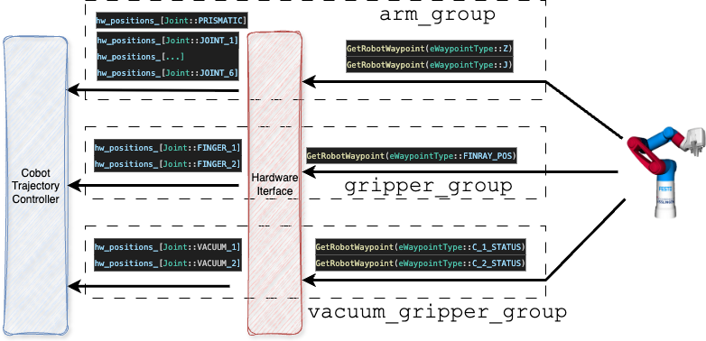

# Cobot Hardware Interface

Manipulation of the Cobot with MoveIt2 and ROS2. This package encapsulates the Festo Cobot API into a ROS2 control hardware interface. The Cobot is controlled physically with this module.

The package is hosted on the GitLab server of the Esslingen University [repo](https://gitlab.hs-esslingen.de/rharbach/cobot_hardware). Hence, in order to control the Cobot, you need to be connected to the HS Esslingen VPN. 


Background: the package contains Festo proprietary implementations and binaries for the communication with the Cobot that were not released to the public. Therefore, this code is hosted on the Esslingen University GitLab while the remaining project is hosted on a public GitHub repository.

## Package Contents
```
├── boost_1_65_0
|
├── config
│   └── festo_node_config.ini
...
├── lib
│   └── libopc_ua.so
|
├── open62541
|
└── src

```

* ```boost_1_65_0``` contains an archive of the Boost version required for the build of ```libopc_ua.so```

* ```lib``` contains a proprietary (by Festo) library extending the OPC-UA implementation

* ```open62541``` an open source OPC-UA implementation

* ```src``` contains the implementation of the ROS2 controller ```cobot_hardware.cpp``` and the Cobot API ```robot_controller_comm.cpp```


## Implementation overview

We have two options to pass commands to the Cobot: single point (the final point of a trajectory, via ```SetRobotWaypoint```) or a list of points (via ```ExecuteInstructionList```, representing a path). We cannot send actual trajectories or fine grained position commands as the SPS of the Cobot takes care of the trajectory (and we cannot by-pass the SPS).

This, unfortunately, does not align with the ROS2 control principles. A basic overview of the trajectory generation and control is provided in the following:
```
MoveIt Planning (OMPL) → Generates a collision free path
                ↓
Time Parameterization Plugin (Iterative / TOTG) → Adds time (making it an actual trajectory)
                ↓
Final RobotTrajectory message
                ↓
MoveIt Simple Controller Manager
                ↓
ros2_control controller
                ↓
HardwareInterface (this package)
```
Now, the ROS2 controller is designed to send position commands to the hardware in real time; which is not suitable for the Cobot. In theory, we could execute ```SetRobotWaypoint``` for each position. This, however is not feasible as the resulting movement of the Cobot becomes jerky. The Cobot will interpret each point as a trajectory and will pause in between.
In previous implementations, we simply sent the final trajectory point to the Cobot (using a custom MoveItControllerManager, *the CobotControllerManager*). Although this resulted in smooth movements of the Cobot arm, the resulting trajectory was calculated by the SPS. We therefore had no influence on the trajectory and collisions that were considered within trajectory planning were obsolete. Hence, even with a camera attached, the Cobot would have been blind.

In order to overcome this limitation we use the instruction list mechanism, where we pass a list of points to the Cobot (```ExecuteInstructionList```). The benefits of this mechanism is an underlying smoothing of the points. Details on the smoothing implementation are provided in chapter 2.19 of the Festo Robotics Manual (refer [GitLab repo](https://gitlab.hs-esslingen.de/rharbach/cobot_hardware)).

Note: the list is nothing other than a path as we do not have an influence on the timing (controlled by the SPS).

Since more than just one point is now send to this hardware interface, we have implemented a custom ROS2 controller (CobotTrajectoryController), that send out either the last point of a trajectory or the entire trajectory to this interface.
Note: ROS2 control implies using single joint commands (declared as double) and since a full trajectory was therefore difficult to be passed, we introduced another communication feature: a singleton realtime buffer.


## Implementation details

The following paragraphs serve as a reference on the major implementation details of the hardware interface.

### CMakeLists.txt

... a rather special one. It includes an `ExternalProject`: an older boost library version, that is required for `libopc_ua.so`. Hence, we extract the archive of the boost library, build it and link it to `libopc_ua.so`. This way the lib is satisfied with the older boost version and the remaining project references the system-wide boost version.

```
ExternalProject_Add(boost165
  URL file://${BOOST_ARCHIVE}
  URL_HASH SHA256=8a142d33ab4b4ed0de3abea3280ae3b2ce91c48c09478518c73e5dd2ba8f20aa
  CONFIGURE_COMMAND ./bootstrap.sh --with-libraries=system,filesystem --prefix=${BOOST_INSTALL_DIR}
  BUILD_COMMAND ./b2 link=shared install -j4
  BUILD_IN_SOURCE 1
  INSTALL_COMMAND ./b2 install
)
#...

set(Boost_INCLUDE_DIRS ${BOOST_INCLUDE_DIR})
set(Boost_LIBRARIES_165
  ${BOOST_LIBRARY_DIR}/libboost_system.so
  ${BOOST_LIBRARY_DIR}/libboost_filesystem.so
)
set_target_properties(opc-ua-api PROPERTIES
  IMPORTED_LOCATION "${CMAKE_SOURCE_DIR}/lib/libopc_ua.so"
  INTERFACE_INCLUDE_DIRECTORIES "${CMAKE_SOURCE_DIR}/include"
  INTERFACE_LINK_LIBRARIES "${Boost_LIBRARIES_165}"
)
```

### Shared Trajectory Buffer

Implemented as a singleton real-time  buffer => accessible from different sources in real-time (enabling thread-safety). It is required to pass full trajectories from the custom ROS2 controller (`cobot_trajectory_controller`) to the hardware interface. Using this data structure, we by-pass the hardware commands for the `arm_group` that are filled by the standard ROS2 controllers and use the full trajectory instead.

### cobot_hardware.cpp

Implements the following methods

```cpp
    // initialize size of internal arrays
    on_init(...);
    // initiate communication with the Cobot
    on_activate(...);
    // send out a list of readable states for the controllers
    export_state_interfaces();
    // send out a list of commands for the controllers
    export_command_interfaces();
    // read states of Cobot joints
    read(...);
    // write commands to Cobot joints
    write(...);

```

#### read(...)

For each joint, we read its current state using the Cobot API's function `GetRobotWaypoint`. We then convert the values for the controller and store it in the `hw_positions_` array. The ROS2 controller manager publishes this array and MoveIt2 can display the state of each joint in rviz / Gazebo.

A graphical overview of the `read` implementation is provided in the following.



#### write(...)

For the `arm_group` (joint_0, ..., joint_6), we use the real-time singleton buffer implemented in `shared_trajectory_buffer.hpp`. It is filled by the `cobot_trajectory_controller`. Once a new buffer is received, we extract the values of the trajectory, convert these for the Cobot and call `ExecuteInstructionList`. 

For the grippers we read the commands directly (`hw_commands_[Joint::FINGER_1]`), convert them into Cobot format and call `SetRobotWaypoint` for each joint.

The vacuum grippers are controlled independently. Moreover the API enables to can control the extension as well as the vacuum system.

A graphical overview of the `write` implementation is provided in the following.


#### Limitation

Joint_0 (the prismatic joint, moving around the linear axis) is executed separately from joint_1, ... joint_6. We first execute the motion of join_0 and subsequently the trajectory of joints 1, ..., 6. This represents a limitation that is required for smooth trajectories (executing a trajectory for all joints would omit smoothing in the Cobot SPS and the motion becomes jerky). For joint_0, we also use only the last point of the trajectory => we drop all intermediate points (also due to otherwise jerky movements). This implies that  trajectories for motions around obstacle which include joint_0 are not feasible on the real Cobot. We can run these only in simulation. An example of an infeasible trajectory is shown in the following: the Cobot avoids getting in contact with the pole by using joint_0. 


On the real Cobot, we would execute the last point of joint_0 first (resulting in no motion in joint_0 since its start position is equivalent to its end position) followed by the trajectory of joints 1, ..., 6.

We believe that this limitation is acceptable for our use case as our goal is to execute pick and place tasks in uncluttered environments.