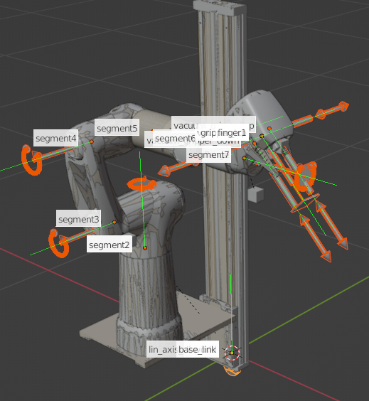
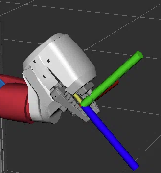
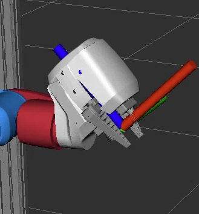
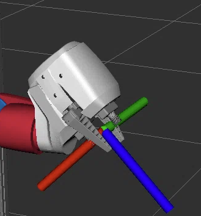
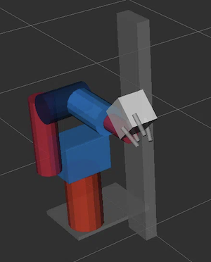

# Cobot Model Overview

The following paragraphs serve as an overview to the basic Cobot Model characteristics. The actual specifics of the model, including our approach on the modelling of the physical attributes, is provided in the [Cobot Modelling Jupyter Notebook](https://github.com/robgineer/cobot/blob/main/src/cobot_model/doc/cobot_modelling.ipynb).

## Robot Overview

The cobot model defines

* an axis element and a corresponding mount,
* 7 segments (the links of the robot),
* 2 fingers (representing the gripper),
* two vacuum grippers,
* four TCP elements for each gripper





## Grippers

We have two types of grippers: a finger gripper and a vacuum gripper system. The vacuum grippers can be controlled independently.

Each gripper defines its own axis.


## URDF

The URDF is implemented as a `xacro` to enable variation handling. We define three variations:

1. `enable_realsense_camera`: to activate the real-sense camera model (deactivated by default)
2. `ros2_controls_plugin`, to select the control type (fake by default) and
3. `use_collision_meshes`, to select between simple and mesh based collisions (mesh by default).


To generate the URDF locally run
```
xacro src/cobot_model/urdf/festo_cobot_model.urdf.xacro -o cobot.urdf
```

## TCPs

Since we define all rotations around the `Z` axis, our TCPs do not have a neutral orientation. This implies the following "obstacle": for a pick and place task, for example, we would position an object into the world that by default would have a neutral orientation. Since our TCP is does not have a neutral orientation, grasping the object would always imply a rotation of the TCP. Hence, for each task, we would need to transform the Cobot's TCP orientation into the object's (neutral) orientation (in the corresponding code).

Since this could be tedious, we have created three additional TCP frames: one TCP aligned to the world frame, and two slightly tilted TCP frames (w.r.t. the world frame) that compensate for the Cobot's natural tilt at the tool base.

Example for the gripper_tcp:


| gripper_tcp | gripper_tcp_world | gripper_tcp_world_tilted_up |  gripper_tcp_world_tilted_down |
|-----------------------|-----------------------|-----------------------|-----------------------|
| The TCP with all rotations | TCP in world frame. <br/> All rotations are inverted. | TCP in world frame tilted by -45 deg. <br/> Compensates the natural tilt <br/> in the physical model, Z+ is up | TCP in world frame tilted by +135 deg. <br/> Compensates the natural tilt <br/> in the physical model, Z+ is down |
|  |  |  |  |


## Modelling Physical Attributes

Neither the mass nor the inertia values were present within the original URDF. We used the following attempts to derive the mass and the inertia values.

* `mass`: we used the volume of each element and expected it to be filled with water (this resulted in an estimated mass value for each element).

* `inertia`: we approximated the elements with basic shapes (cuboid / cylinder) and applied inertia tensors using their dimension values.

### Result

Visual display of inertia and mass values of the Cobot:

| Inertia | Mass | 
|---------|------|
| | | 


## Modelling Collisions

Collisions define boundaries of robot elements. They allow to identify physical collisions of the robot with itself or with its environment and can be either defined with simple geometric shapes or with meshes.

### Collision Meshes

We used the same meshes for collisions and visuals but reduced the number of faces for the collision meshes (to ease up planning and simulation).

### Simple Geometric Shapes

In order to simplify collision checking even further (for specific corner cases, for example) we have created collisions from geometric shapes. Refer `use_collision_meshes` parameter in `xacro`.

