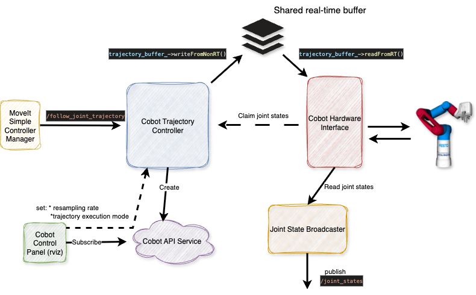
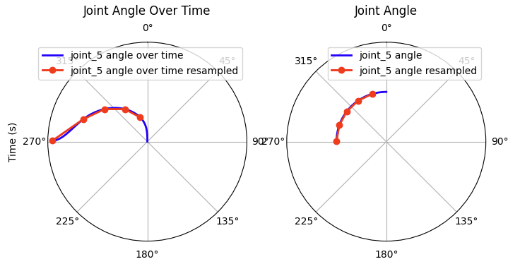

# Cobot Trajectory Controller

Custom ROS2 controller for the Cobot.
This controller works only in combination with the `cobot_hardware` package and aims to control the real Cobot.

In order to manipulate the Cobot in ROS2, make sure you have pulled the `cobot_hardware` submodule. Run this controller with

```
ros2 launch demo rviz_demo_launch.py controller_type:=real
```

## Implementation Overview

We have two options to pass commands to the Cobot API: single point (the final point of a trajectory, via ```SetRobotWaypoint```) or a list of points (via ```ExecuteInstructionList```, representing a path). We cannot send actual trajectories or fine grained position commands as the SPS of the Cobot takes care of the trajectory (and we cannot by-pass the SPS).

This, unfortunately, does not align with the ROS2 control principles. A basic overview of the trajectory generation and control is provided in the following:
```
MoveIt Planning (OMPL) → Generates a collision free path
                ↓
Time Parameterization Plugin (Iterative / TOTG) → Adds time (making it an actual trajectory)
                ↓
Final RobotTrajectory message
                ↓
MoveIt Simple Controller Manager
                ↓
ros2_control controller
                ↓
HardwareInterface
```
The ROS2 controllers are designed to send position commands to the hardware in real time; which is not suitable for the Cobot. 

In previous implementations, we simply sent the final trajectory point to the Cobot (using a custom MoveItControllerManager, *the CobotControllerManager*). Although this resulted in smooth movements of the Cobot arm, the resulting trajectory was calculated by the SPS. We therefore had no influence on the trajectory and collisions that were considered within trajectory planning were obsolete. Hence, even with a camera attached, the Cobot would have been blind.

In order to overcome this limitation we use the instruction list mechanism, where we pass a list of points to the Cobot and since the standard implementation of the ROS2 trajectory controller does not allow to send full trajectories (or lists of points), we are using this custom ROS2 controller, that send out either the last point of a trajectory or the entire trajectory to this interface.
Note: ROS2 control implies using single joint commands (declared as double) and since a full trajectory was therefore difficult to be passed, we introduced another communication feature: a singleton realtime buffer.

```
MoveIt Planning (OMPL) → Generates a collision free path
        ↓
Time Parameterization Plugin (Iterative / TOTG) → Adds time (making it an actual trajectory)
        ↓
Final RobotTrajectory message
        ↓
MoveIt Simple Controller Manager
        ↓
cobot_trajectory_controller (this package)
        ↓ trajectory (via shared buffer)
cobot_hardware
```

## Implementation Details

The Cobot Trajectory Controller forwards trajectories to the hardware interface in three steps:

1. accept a trajectory from the MoveItSimpeControllerManager,
2. resample the trajectory points (optional) and
3. place the entire trajectory or its last point into a shared buffer for the hardware interface.

A communication overview between MoveIt2, the Cobot Trajectory Controller and the hardware interface is provided in the following.




List of the major functions implemented:

```cpp
    /*
     * Expose the command interfaces to the controller manager
     */
    command_interface_configuration()

    /*
     * Expose the state interfaces to the controller manager
     */
    state_interface_configuration()

    /*
     * Configure ROS2 environment
     */
    on_configure(const rclcpp_lifecycle::State &previous_state)

    /*
     * Callback for reception of /follow_joint_trajectory
     */
    goal_callback(...)

    /*
     * Communication with the hardware interface.
     * Fills a realtime buffer with a trajectory for the hardware interface.
     */
    update(const rclcpp::Time &time, const rclcpp::Duration &period)

    /*
     * Spatial trajectory resampling for the reduction of points.
     */
    resample_trajectory(const trajectory_msgs::msg::JointTrajectory &trajectory)

    /*
     * Initiate the service (cobot_api_service_) between this controller
     * and the rviz panel
     */
    setup_service_for_rviz_panel()
```

Graphical overview.


### command_interface_configuration / state_interface_configuration

We claim the states published by the cobot hardware interface as well as the commands send to the hardware interface. This has to be aligned with the ros2 control configuration. Refer `cobot_moveit_config/ros2_controllers.yaml`
```yaml
 cobot_arm_group_controller:
      type: cobot_trajectory_controller/CobotTrajectoryController
 #...
 cobot_arm_group_controller:
  ros__parameters:
    joints:
      - joint_0
      - joint_1
      - joint_2
      - joint_3
      - joint_4
      - joint_5
      - joint_6
    command_interfaces:
      - position
    state_interfaces:
      - position
      - velocity
```

**Note** we do not access the `state_interfaces` in this controller; which is a rather unlikely setup. In a standard controller, we would read the states of the joints and adapt our control commands based on the current state of each joint => what a rea-time controller usually does. Since we do not have any influence on the trajectory execution (which is handled by the Cobot SPS), we simply claim the states (as defined in the configuration) but do not read them. Reading and publishing the states for the remaining system is handled byt the `joint_state_broadcaster`.

### on_configure

1. Defines an `action_server` that listens to the `/follow_joint_trajectory` and executes `goal_callback(...)` on reception of the topic.
2. Sets ROS2 parameters for `execution_mode` as well as the corresponding `resampling_delta`. 

`execution_mode = single_point` only the last point of a trajectory is send to the hardware interface.
`execution_mode = full_trajectory` the full trajectory is send to the hardware interface.
`resampling_delta` defines the spacial minimum delta between two trajectory points. This implementation enables smoother motions on the Cobot. If we send out a trajectory that has too many points, the Cobot's SPS will only be able to execute these with a jerky movement.


### goal_callback

Fills an internal trajectory buffer on reception of `/follow_joint_trajectory`. This is required due to the asynchronous execution of `update` and the reception of the `/follow_joint_trajectory` topic.


### update

The ROS2 Control Manager calls this function periodically. The implementation checks if the internal trajectory buffer was updated and runs an optional re-sampling of the received trajectory.

**Note** we slowed down the periodic execution of this function from `100` hz (default) to `10` hz. Background: since we do not have real-time control, a high frequency execution is not required. Refer: `cobot_moveit_config/ros2_controllers.yaml`


### Resampling

Spatial trajectory resampling for the reduction of points.

In case full trajectory forwarding is active (`execution_mode == full_trajectory`), we forward the entire trajectory to the hardware interface.

Since the Cobot does not accept timing based commands but a path and since dense trajectory points imply jerky movements, we resample the trajectory based on a minimum distance between two subsequent trajectory points. This can be adjusted using the parameter: `resampling_delta`.


```
Example with resampling_delta = 0.5

Trajectory point:     0     1     2     3     4     5     6     7     8
 --------------------------------------------------------------------------
Joint_1 pos (rad):   0.0   0.2   0.4   0.6   0.8   1.0   1.2   1.4   1.6
Selected:             -     -     #     -     -     #     -     -     #
Joint_2 pos (rad):   0.0   0.2   0.4   0.6   0.8   1.0   1.0   1.0   1.0
Selected:             -     -     -     -     -     -     -     -     #

 # = selected point
 - = skipped point (delta < resampling_delta)

Resampled trajectory point:     0     1     2
 -----------------------------------------------
 Resampled joint_1 pos (rad):   0.4   1.0   1.6
 Resampled joint_2 pos (rad):   0.4   1.0   1.0

Note: in practice all joints move with the same velocity
(we have defined the same limits for each joint in the configurations)
```

Graphical interpretation of  trajectory resampling on real data (joint 5):
```
number of initial traj. points: 68
resampling_delta: 0.3
=>  number of resampled traj. points: 5
```



### CobotApiSrv

`execution_mode` and `resampling_delta` are defined as parameters that can be updated on demand using:
```
ros2 param set /cobot_arm_group_controller execution_mode full_trajectory
ros2 param set /cobot_arm_group_controller resampling_delta 0.3
```

In order to increase usability, we have implemented a small rviz plugin that communicates with the Cobot Trajectory Controller and that enables updating these parameters in rviz.
