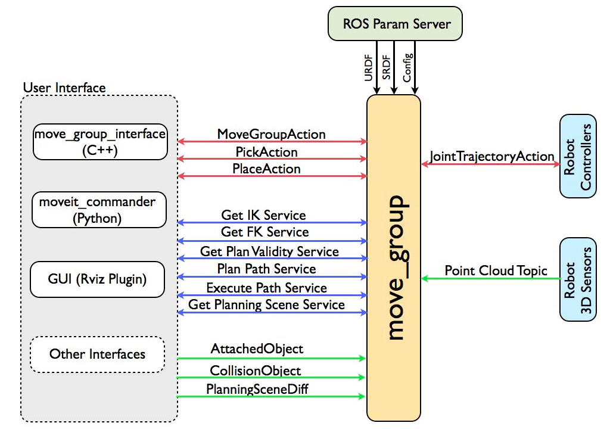

# Launch Files Explained

Since launch files can be a bit tricky to implement and understand, the following paragraphs focus on their basics.

The project contains two major launch files:

* `src/cobot_moveit_config/launch/gz_demo_launch.py`
* `src/demo/launch/rviz_demo_launch.py`

Both have the same basic structure; which is explained in the following.

## 1. Load the Configuration Files

We need to load and parse the configuration for the

* robot model (`festo_cobot_model.urdf.xacro`),
* robot sematics (`festo_cobot_model.srdf`),
* IK config (`kinematics.yaml`),
* joint limits (`joint_limits.yaml`) and 
* the moveit / ros2_control configuration (`moveit_controllers.yaml`/ `ros2_controllers.yaml`).

We additionally define parameters that are not included in the yaml files (for the planning scene monitor and the ompl planner pipeline). All of these are default parameters and have been taken over from other ros2_control project examples.

## 2. Start the ROS2 Nodes

We start the following nodes: 

* ros2_control controllers (defined in `ros2_controllers.yaml`), 
* the `joint_state_broadcaster` to broadcast the current joint states,
* the robot state publisher (that publishes the URDF as well as the joint states from the `joint_state_broadcaster`),
* rviz and
* the `move_group` (the MoveIt2 node).

The `move_group` communicates with the user interfaces (C++ API / Python API / rviz) as well as with the sensors and the ROS2 controllers. An overview of the `move_group` node is provided in the following:

Source: https://moveit.picknik.ai

For gazebo (`src/cobot_moveit_config/launch/gz_demo_launch.py`) we also start the gazebo node and in the demo (`src/demo/launch/rviz_demo_launch.py`) we start the real-sense camera node.

Note that we define several parameters in `src/demo/launch/rviz_demo_launch.py`:

* `enable_realsense_camera` to start real sense camera; `false` by default.
* `use_collision_meshes` select to either either use actual collision meshes (`true`) or simple geometric objects (`false`); `true` by default.
* `controller_type` using rviz only (`fake`) or the Cobot Trajectory Controller (`real`); `fake` by default.

(Opaque function: we need to know the parameters during execution for the `xacro`.)

The additional launch file for the pick and place example (`src/demo/launch/pick_place_launch.py`) is required only due to the fact that the `moveit_task_constructor_demo` expects several launch arguments (such as the URDF model and the SRDF configuration).
