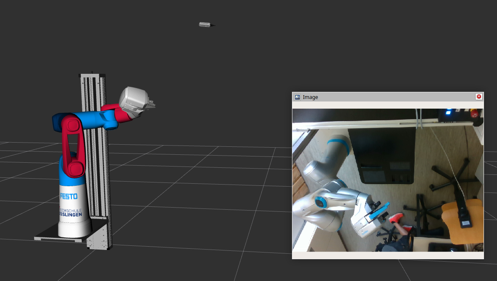
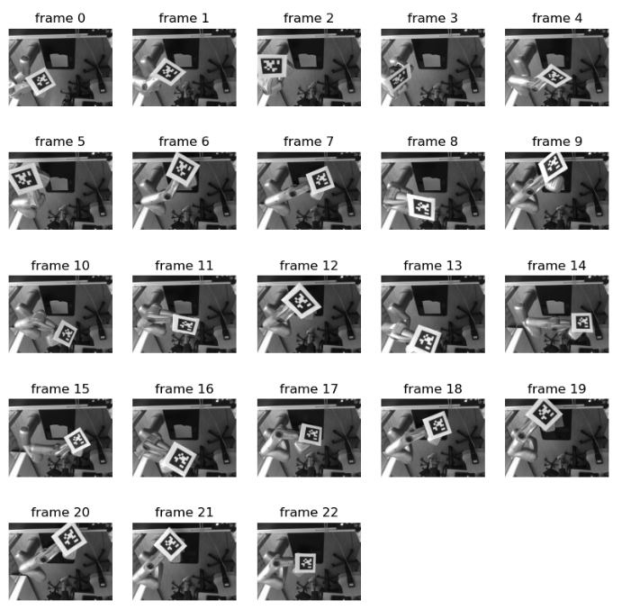

# Offline Hand-Eye Calibration

This is a package for hand-eye calibration of a manipulator arm with a static camera. It has been tested with ROS2 jazzy on our robot at the University of Applied Sciences in Esslingen.



Although there are very nice packages for hand-eye calibration available (notably easy_handeye2, see link below), we have decided to compile a new package for two reasons:

- Several times in the past, we have encountered difficulties due to incompatibilities with different ROS versions and libraries such as OpenCV - what is working now may not work anymore in the next major ROS version. Thus, we want a solution that is rather independent of ROS.

- We want some introspection of the calibration process, e.g. inspect individual data frames and potentially remove them from the calibration process or other manual debugging. A python version is well suited for this.

The calibration process consists of three major steps (detailed further below):

1. **Extract frames**: obtain camera information, camera images and robot coordinate transformations (using tf2_ros) for selected calibration frames.
2. **Calibrate**: Detect markers in the image (using apriltags) and recover the extrinsic parameters of the camera (using OpenCV).
3. **Publish results**: Publish the calibration results in our ros2 environment.

In this process, only the first and last step should include ROS to keep dependencies at bare minimum.

The package is a compilation and adaptation of other work. Here are some important links:

- <https://github.com/marcoesposito1988/easy_handeye2>
- <https://github.com/AprilRobotics/apriltag> (with Python bindings)

## ROS2 TF preliminaries

Running the calibration requires awareness of existing coordinate frames in our environment. This is done via [tf2_ros](https://docs.ros.org/en/jazzy/Tutorials/Intermediate/Tf2/Introduction-To-Tf2.html).

To get an overview of the tree of coordinate transformations in your environment, you can create a pdf of all frames with

```bash
ros2 run tf2_tools view_frames
```

And to check the current transformations between two frames via command line, use

```bash
#Usage: tf2_echo source_frame target_frame
ros2 run tf2_ros tf2_echo base_link camera_color_frame
ros2 run tf2_ros tf2_echo base_link camera_color_optical_frame
```

In our case, the excerpt of our camera transformations (i.e. the objectives of our calibration) are structured as follows:

The coordinate frames of the Realsense camera in ROS are described here: [realsense-ros](https://github.com/IntelRealSense/realsense-ros).

Please note that in our setup, the root of the camera node (which also defines its global pose) is the TF ``camera_bottom_screw_frame``. The perspective projection of the camera is computed wrt ``camera_color_optical_frame``. This may be different for your setup, of course.

## Extract frames

For calibration, we rigidly attach an Apriltag to our robot's endeffector and record sample images and corresponding TFs.


The tag can be printed from this pdf: [img/tag36h11_0_140mm.pdf](img/tag36h11_0_140mm.pdf) or generated with this [online generator](https://shiqiliu-67.github.io/apriltag-generator). Make sure to print with actual size and note the size of the marker (for the tag in this repo, it is 0.14 meters).

Next, start the robot and camera

```bash
ros2 launch demo rviz_demo_launch.py controller_type:=real enable_realsense_camera:=true
```

and record sample frames:

```bash
ros2 run offline_hand_eye record_calib_data
```

This will open the following GUI where parameters have been adapted from [easy_handeye2](https://github.com/marcoesposito1988/easy_handeye2):


- ``Calibration Type``: ``eye_on_base`` for a static camera, ``eye_in_hand`` when camera is attached to the robot arm
- ``Camera Image Topic``: ROS topic with the color image of your camera
- ``Camera Info Topic``: ROS topic with intrinsic parameters of your camera
- ``Robot Base Frame``: the base or world frame of your environment
- ``Robot Effector Frame``: the TF frame of the robot's end effector
- ``Tracking Base Frame``: the TF frame of the camera, markers are reconstructed wrt to this
- ``Tracking Marker Frame``: optional, the TF of detected markers if these markers are detected online while extracting.
- ``Recording Directory``: all extracted frames will be stored here in pickle format.

Once you have set or loaded these parametes, you can start to move the robot arm around and record some frames. Recording can be done continuously (not recommended at the moment, see issue below) or in single shots.

Rule of thumb is to record 12 frames or more. Make sure that the calibration target is moved across a large part of the camera image, shows variation in distance to the camera and significant variations in orientation, as e.g. here:


Make sure to save your configuration parameters! Default location for this file is in the root of your repo with filename ``handeye_calibration_params.json``.

You may also use a recording and run ``record_calib_data`` from the replay (but make sure that the TFs are all received properly):

```bash
ros2 bag record --all
ros2 bag play <your_recording>
```

> **Timing Issue**: When querying TFs for the time stamp of the current image, we often do not receive valid results in our current environment. As a workaround for this problem, we acquire frames only after the robot is standing completely still, i.e. move the robot to a new position, wait shortly and make sure that rviz shows the correct setup, record sample frame, repeat. That way, we can safely utilize the latest TFs, cf. ``record_calib_data.py``. This should be fixed!

## Calibrate

The calibration process itself does not need ROS! So we can focus on the actual computation (almost any version of opencv and numpy) and debugging.

To install a virtual environment and a jupyter kernel, use:

```bash
conda create --name offline-hand-eye python=3.12 ipython jupyter conda-forge::matplotlib 
conda activate offline-hand-eye
pip3 install opencv-python
conda install conda-forge::apriltag
python -m ipykernel install --user --name=offline-hand-eye
```

This has been tested with miniconda, but should also work with venv.

A good starting point for understanding the calibration process is the Jupyter notebook in <scripts/offline_hand_eye_calibration.ipynb>.

A more comfortable version of the calibration is using a GUI where you can check, select, and exclude different frames for calibration:

```bash
conda activate offline-hand-eye
cd scripts
./offline_hand_eye_calibration_gui.py --data_path ../doc/sample_data/calibration/calibdata_2025_08_11-11_51_22 --config ../../../handeye_calibration_params.json --output ../../../handeye_calibration.json
```


## Publish results

After the calibration has been computed, you can publish the resulting TFs. Start the environment:

```bash
ros2 launch demo rviz_demo_launch.py controller_type:=real enable_realsense_camera:=true
```

and publish the calibrated TFs:

```bash
ros2 run offline_hand_eye calib_publisher --ros-args -p calibration_file:=handeye_calibration.json
```

Now, run

```bash
ros2 run tf2_ros tf2_echo base_link camera_bottom_screw_frame
```

to print the extrinsic calibration in the console, e.g.

```text
At time 0.0
- Translation: [0.659, 0.459, 1.550]
- Rotation: in Quaternion [-0.604, 0.696, 0.293, 0.254]
- Rotation: in RPY (radian) [2.999, 0.787, -1.771]
- Rotation: in RPY (degree) [171.830, 45.092, -101.471]
- Matrix:
 -0.140 -0.990  0.000  0.659
 -0.692  0.098  0.715  0.459
 -0.708  0.100 -0.699  1.550
  0.000  0.000  0.000  1.000
```

You may also use this translation and rotation in RPY (radian) to adjust the camera transform in <cobot_model/urdf/festo_cobot_model.urdf.xacro>.

### For future use: running tag detectors online

To run the apriltag detector online, use:

```bash
sudo apt install ros-jazzy-apriltag-ros
ros2 run apriltag_ros apriltag_node --ros-args \
    -r image_rect:=/camera/camera/color/image_raw \
    -r camera_info:=/camera/camera/color/camera_info \
    --params-file /workspace/src/offline_hand_eye/doc/tags_36h11.yaml
```

Or for the aruco marker:

```bash
sudo apt install ros-jazzy-aruco-ros
ros2 run aruco_ros single --ros-args -p image_is_rectified:=true -p marker_size:=0.1 -p marker_id:=1 -p reference_frame:=camera_link -p camera_frame:=/camera/camera/color/image_raw -p marker_frame:=camera_marker -p corner_refinement:=LINES
```
