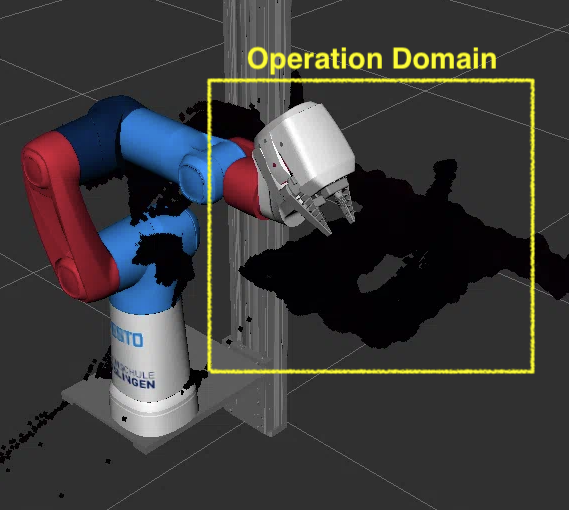
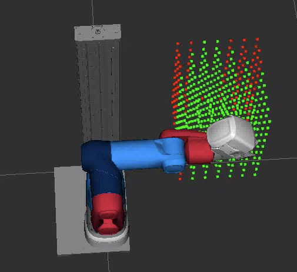
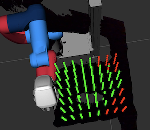
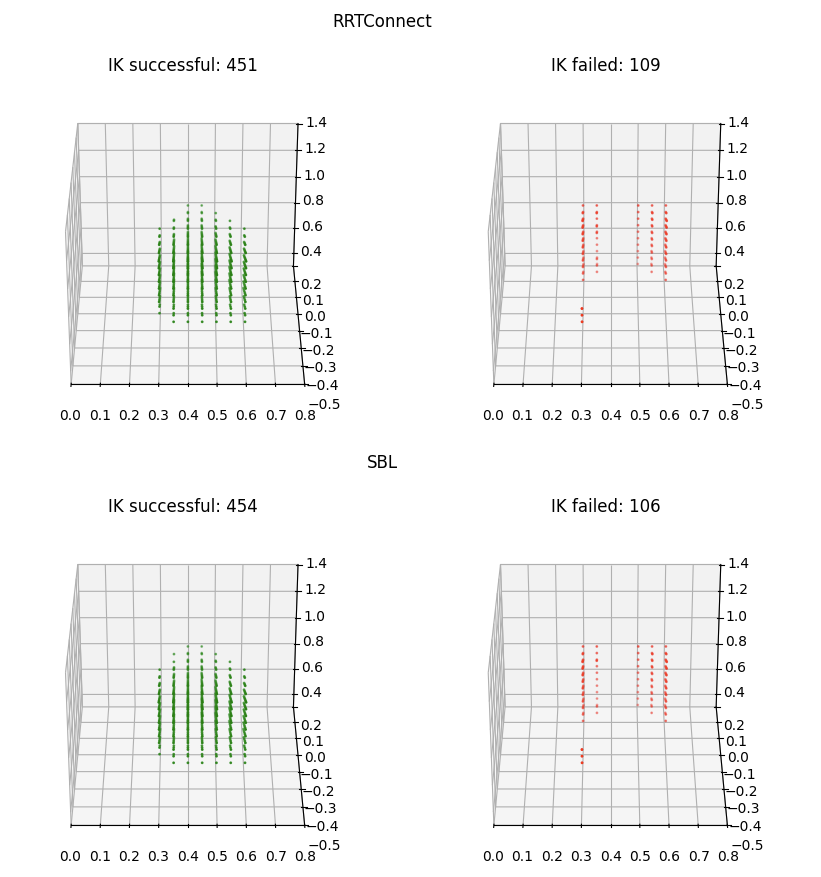
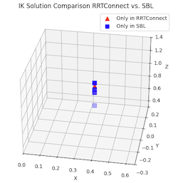

# Planner Evaluation


We have evaluated several planners for their applicability with the Cobot.

* `RRTConnect`: the default choice in MoveIt2; fast and reliable. Creates two Rapidly-exploring Random Trees (RRTs) - one from the start, one from the goal — and tries to connect them.
* `SBL`: Single-query Bi-directional Lazy planner. Plans (lazy) without collision checking validates after the path was found.
* `LBKPIECE`: Uses projection evaluation (joint dimension reduction, refer [this page](https://ompl.kavrakilab.org/projections.html) for more details). OMPL config: `projection_evaluator`.
* `AnyPathShortening`: a (meta) planner that runs several planners in parallel.


Although `AnyPathShortening` seems like a good approach, it is slower than a single planner and although we defined 6 different planners, observations revealed that in most cases only `SBL`, `LBKPIECE` or `RRTConnect` were used by `AnyPathShortening`.


A comparison further revealed that `SBL` yields the best results in our operation domain (the small table attached to the Cobot in direction x+).

## Evaluation Setup
We have defined a bounding box (representing the operation domain) around the work bench and filled the bound box with points; using a resolution of `kDelta = 0.05  # 5 [cm]`.
```
kXMin, kXMax = 0.3, 0.65
kYMin, kYMax = -0.3, 0.1
kZMin, kZMax = 0.5, 1.0
```
Point Cloud image of workbench:




For each (randomly selected) point in the bounding box, we ran the  `SBL`, `LIBPIECE` and `RRTConnect` planner using the `ik_reachable_set` script; that plans a path with inverse kinematic (IK) and displays successful and failed runs.
Each planner had a timeout of `0.5` seconds. 

Goal was to identify on how many points can be approach by the Cobot from above (for a pick and place task for example). We made sure that an IK solution was not just successful because point were located next to each other by selecting points from the bounding box randomly.

Example (green: successful IK runs, red: failed IK runs)


## Results

The final "point cloud" for the `SBL` planner is shown in the following.




We can see that most points are accessible and the missing points are located at the edges of the bounding box and result from physical limitations (some are out of reach of the Cobot). Example: even with joint 3 and 4 extracted, the configuration with the longest reach of the cobot, the points in the right corner imply difficulties to approach from above.


Projecting the points on the workbench shows that the reach is acceptable.




While all three planners yield similar results, `SBL` seemed to have found more solutions overall.

A (visual) comparison of successful and failed IK runs for `SBL` and `RRTConnect` (representing the default planner) is shown in the following.



An comparison of the points that were only found by `SBL` or `RRTConnect` yields that these belong to the left corner, an areal difficult to reach due to the physical characteristics of the Cobot.



=> Selecting `SBL` due to the fact, that it found more solutions for the corners.