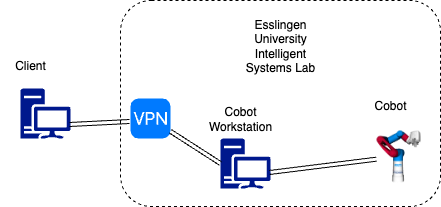

# Quickstart Guide

Follow the instructions below to plan and execute trajectories in simulation or on the real Cobot.

## Common Steps 

### 1. Clone this Repo

```
git clone https://github.com/robgineer/cobot.git cobot
cd ~/cobot
```

### 2. Install docker
The entire dev. environment is based on a docker container. If you running Ubuntu and you don't have docker installed, run the following script.
```
./scripts/docker_installation.sh
```

### 3. Choose your GUI
We offer two different options for displaying the graphical user interface: xpra or VNC. Both are different and have their specific use cases.

* The VNC option enables viewing an entire Ubuntu Desktop within your browser. Useful in case you are running this project on a local machine. Refer [VCN setup](howToVNC.md) for details and configuration.
* The xpra option enables forwarding single X11 windows from your terminal. Its a bit more lightweight and useful if you are running this project on a remote machine. It requires your user to be ported into the docker container, however. This might not work on all configurations. Refer [Xpra setup](howToXpra.md) for details and configuration.


Once you have configured your preferred GUI type, proceed with either the simulation or real control steps.

## Simulation


### 1. Build the project

```
source /opt/ros/jazzy/setup.{bash/zsh}
cd ~/cobot
colcon build --merge-install --symlink-install --cmake-args "-DCMAKE_BUILD_TYPE=Release" --packages-select cobot_model cobot_moveit_config demo py_demo
source install/setup.{bash/zsh}
```

#### Colcon build options explained

`merge-install:` Do not create separate `install` folders for each package bur merge everything into one.

`symlink-install:` Do not copy built files into the install folders but create a symlink. Changes in Python files, for example, take effect immediately (no re-building required).

`cmake-args "-DCMAKE_BUILD_TYPE=Release":` Optimize build for speed

`--packages-select cobot_model cobot_moveit_config demo py_demo:` We only need these packages for a simulation.


### 2. Launch Moveit2 and ROS2 Control

#### Option A: Fake Controllers
This is an rviz only setup that enables to visualize Cobot motions based on fake controllers; omitting any physics.

```
ros2 launch demo rviz_demo_launch.py
```


#### Option B: Gazebo Controllers
This setup enables to visualize requested trajectories in rviz and in Gazebo. The Gazebo part will consider physical characteristics of the model such as mass and inertia. 

```
ros2 launch cobot_moveit_config gz_demo_launch.py
```

### 3. Control the Cobot in Simulation

You can either drag the Cobot's end effector in rviz to a preferred position via the MoveIt2 motion planning plugin and execute the resulting trajectory or run a demo.
Example:
```
ros2 run demo simple_ik
```
or (fake controllers only)
```
ros2 run py_demo simple_ik_fk
```


## Real Cobot Control

Setup overview:



### 1. Clone submodules


In order to manipulate the Cobot in ROS2, connect to HS-Esslingen VPN, log in into the dedicated workstation for the Cobot and run
```
source /opt/ros/jazzy/setup.{bash/zsh}
cd ~/cobot
git submodule init src/cobot_hardware src/realsense-ros
git submodule update src/cobot_hardware src/realsense-ros
```
to pull the submodules.

Build with:

```
colcon build --merge-install --symlink-install --cmake-args "-DCMAKE_BUILD_TYPE=Release" --packages-skip moveit_task_constructor
```
=> build everything except of the `moveit_task_constructor` (not required for the basic tasks).

Don't forget to source
```
source install/setup.{bash/zsh}
```

**Note** if you are not connected to the HS-Esslingen VPN, the ```cobot_hardware``` submodule will not be cloned and you will not be able to control the Cobot via MoveIt2 / ROS2. 

### 2. Launch Moveit2 and ROS2 Control

Launch `rviz_demo_launch.py` with `controller_type:=real` and `enable_realsense_camera:=true`
```
ros2 launch demo rviz_demo_launch.py controller_type:=real enable_realsense_camera:=true
```

### 3. Control the Cobot

Same as in simulation, you can either drag the Cobot's end effector in rviz to a preferred position via the MoveIt2 motion planning plugin and execute the resulting trajectory or run a demo.
Example:
```
ros2 run demo simple_ik
```

### How to handle rogue grippers

Once activated, the vacuum system remains active; even if the cobot is shut down physically (the red emergency button on the cobot table).
In order to deactivate the vacuum system, run
```
ros2 run cobot_hardware gripper_off
```