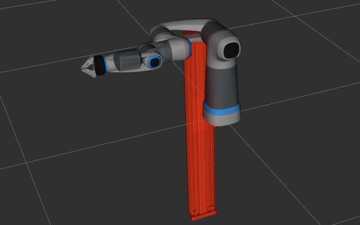
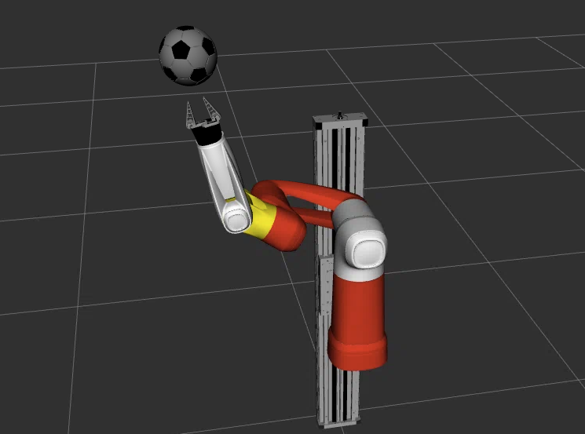

# Cobot Model

## Copyright Notice
The model was kindly provided by the company [**Festo SE & Co. KG**](https://www.festo.com/) and remains their intellectual property. Refer to their [GitHub profile](https://github.com/Festo-se) and their [website](https://www.festo.com/de/en/e/about-festo/blog/robotics-id_9229-1153/) for more information on their robotics related activities.
<br/>
<br/>
The model is adjusted based on the needs of this project. To access the original model refer commit [67d2b63d4f9a76d7f5c2ebf66c67b8af61d7ccd1](https://github.com/robgineer/artbot/commit/67d2b63d4f9a76d7f5c2ebf66c67b8af61d7ccd1).
<br/>
<br/>
License: the model (folder: *meshes* / *urdf*) is licensed under Apache-2.0. Kindly refer to the LICENSE.txt for more information.

## Model Overview

The model used represents a pneumatic arm with seven joints, indexed as: 0 - 6, and a functional gripper. <br/>

### Original Cobot Model

In its original form, the model does not contain any physics related information as *mass* or *inertial* values necessary for the simulation. These values, along with a functional gripper, have be added within the scope of this project.
<br/>




### Current Cobot Model: Champion

**The color scheme serves as a tribute to VfB Stuttgart’s victory in the DFB-Pokal (German Cup) of 2025**

Adjustments made:
* added world link
* added functional gripper
* combined links (the original version contained several smaller links that made inertia calculations tricky)
* added collision meshes
* added realistic physical attributes for simulation (inertia and mass)
* cleaned up numerical values
* adjusted XML formatting
* changed colors of all links

The entire re-modelling (incl. all calculations) is documented in ```doc/cobot_modelling.ipynb```.



