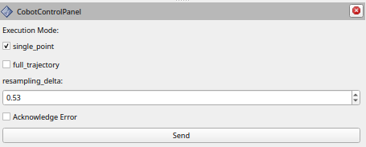

# Cobot rviz plugins

Currently holds the cobot_control_pane;. Its purpose is to set custom parameters and send specific commands to the Cobot hardware that are not triggered by MoveIt2 / ROS2 control.

Supports the following commands:

```
single_point: send either the last point of a trajectory to the hardware interface
full_trajectory: send the entire trajectory to the hardware interface
resampling_delta: up-sampling for "full_trajectory" mode to contain only points that have a minimum delta in between
acknowledge_error: reset Cobot error (on the Cobot hardware)
request_abort: initiate an abort of a trajectory execution (on the Cobot hardware)
```

