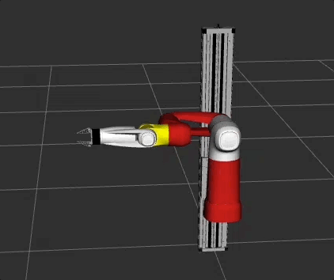
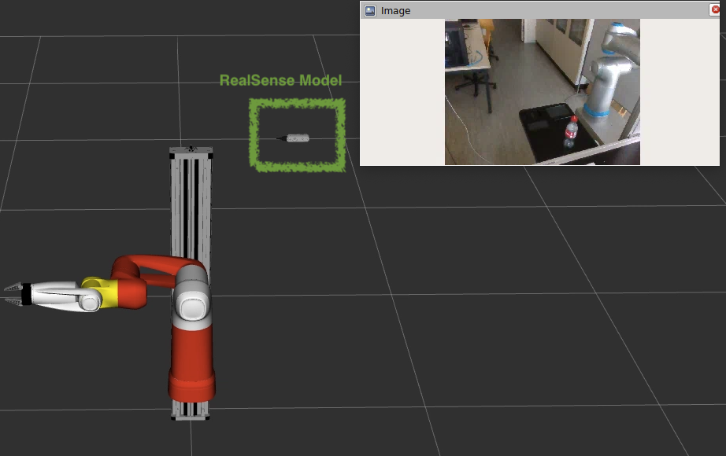

# Demos for Cobot with MoveIt2 and Gazebo

We have currently two demos implemented: 
* a simple inverse kinematic demo using MoveIt2 and their C++ interface and 
* a pick and place demo using the MoveIt Task Constructor


## Running the IK demo

Launch the gazebo demo
```
ros2 launch cobot_moveit_config gz_demo_launch.py
```
Run the demo (in a separate terminal)
```
ros2 run demo simple_ik
```

To run the demo with fake controls, use the following launch-file:
```
ros2 launch demo rviz_demo_launch.py
```



## Running the MoveIt Task Constructor Pick and Place demo

This demo has been taken over from the MoveIt Task Constructor repo. Make sure you have cloned this repo with ``--recurse-submodules`` option to fetch the ``moveit_task_constructor`` repo.

Launch the rviz demo
```
ros2 launch demo rviz_demo_launch.py
```
Run the demo (in a separate terminal)
```
ros2 launch demo pick_place_launch.py
```


## Launch Cobot in rviz with RealSense camera

```
ros2 launch demo rviz_demo_launch.py enable_realsense_camera:=true
```


