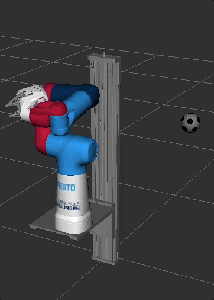

# Demos for Cobot with MoveIt2 and Gazebo

We have currently two demos implemented: 
* a simple inverse kinematic demo using MoveIt2 and their C++ interface and 
* a pick and place demo using the MoveIt Task Constructor


## Runing the MoveIt2 Gazebo demo
```
ros2 launch cobot_moveit_config gz_demo_launch.py
```
This will open a gazebo / rviz GUI that allows the manipulation of the cobot.


To control the joints in gazebo and rviz manually run the ```rqt_joint_trajectory_controller``` in a separate terminal (don't forget to start an xpra session with a different display
and connect to it from your client machine if you are using xpra).
```
ros2 run rqt_joint_trajectory_controller rqt_joint_trajectory_controller
```

## Running the IK demo

This demo serves as a reference for the usage of the MoveIt2 C++ API and the different TCP frames defined in the model.
For the the Python pendant: check out the `py_demo` package.

Launch the gazebo demo
```
ros2 launch cobot_moveit_config gz_demo_launch.py
```
Run the demo (in a separate terminal)
```
ros2 run demo simple_ik
```
Note: the max. acceleration / velocity need to be reduced in order to run the entire demo in gazebo (the planning requests are too fast for the gazebo simulation).

To run the demo with fake controls, use the following launch-file:
```
ros2 launch demo rviz_demo_launch.py
```



## Running the MoveIt Task Constructor Pick and Place demo

This demo has been taken over from the MoveIt Task Constructor repo. Make sure you have cloned this repo with ``--recurse-submodules`` option to fetch the ``moveit_task_constructor`` repo.

Launch the rviz demo
```
ros2 launch demo rviz_demo_launch.py
```
Run the demo (in a separate terminal)
```
ros2 launch demo pick_place_launch.py
```


## Launch Cobot in rviz with RealSense camera

```
ros2 launch demo rviz_demo_launch.py enable_realsense_camera:=true
```


