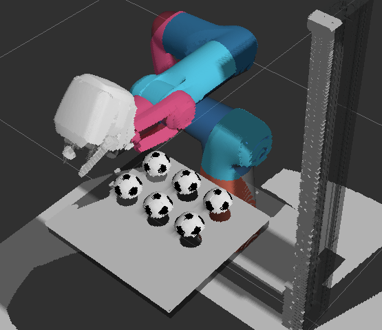
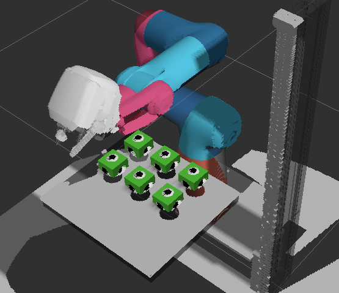

# Perception Pipeline

This package contains applications for object detection using a RGBD camera. It works with the RealSense mounted on the Cobot and a simulated Gazebo RGBD sensor.


## Using the RealSense camera

The RealSense node (refer: `src/realsense-ros/realsense2_camera/launch/rs_launch.py`) publishes three topics of interest

1. color image `/camera/color/image_raw`
2. depth image `/camera/depth/image_rect_raw`
3. point cloud `/camera/camera/color/points`


We use the depth image for the MoveIt2 Planning Scene that creates an occupancy grid (filtering out the Cobot links). The configuration of the MoveIt2 perception is defined in `src/cobot_moveit_config/config/sensor_3d.yaml`.

Overview

```text
RealSense → /camera/depth/image_rect_raw → MoveIt2 → Planning Scene → occupancy grid
        | → /camera/depth/image_rect_raw → rviz depth image
        | → /camera/camera/color/points → rviz PointCloud2

```

Starting the RealSense camera on the Cobot with real controls requires to pull and build the `cobot_hardware` and the `realsense-ros` package. 

To build, run

```bash
git submodule init src/cobot_hardware src/realsense-ros
git submodule update src/cobot_hardware src/realsense-ros
colcon build --merge-install --symlink-install --cmake-args "-DCMAKE_BUILD_TYPE=Release" 
```

Then source your workspace
```bash
source install/setup.{bash/zsh}
```

To run the Cobot with real controls and an active camera, run
```bash
ros2 launch demo rviz_demo_launch.py controller_type:=real enable_realsense_camera:=true
```


## Using Gazebo's RGBD sensor

The RGBD sensor plugin in Gazebo (defined in `src/cobot_moveit_config/launch/custom_world.sdf`) simulates the RealSense camera. We publish the same topics as with the RealSense via the ROS bridge. 

With Gazebo we use the point cloud for MoveIt's occupancy grid.

1. color image `/world/default/model/depth_camera/link/camera_link/sensor/depth_camera_sensor/image`
2. depth image `/world/default/model/depth_camera/link/camera_link/sensor/depth_camera_sensor/depth_image`
3. point cloud `/world/default/model/depth_camera/link/camera_link/sensor/depth_camera_sensor/points`


Overview
```text
Gazebo RGBD sensor → ROS bridge → point cloud topic → MoveIt2 → Planning Scene → occupancy grid
                              | → point cloud topic → rviz PointCloud2
                              | → depth image topic → rviz depth image
                              | → color image topic → rviz color image

```

Running the Gazebo RGDB camera, you need to build the following packages
```bash
colcon build --merge-install --symlink-install --cmake-args "-DCMAKE_BUILD_TYPE=Release" --packages-select cobot_model py_utils cobot_moveit_config demo
```

Then source your workspace
```bash
source install/setup.{bash/zsh}
```

and run 
```bash
ros2 launch cobot_moveit_config gz_demo_launch.py
```

This will start Gazebo and rviz.


## Running Object Recognition

At the moment we have implemented one perception feature: a simple object detection based on DBSCAN clusters from the RGBD camera. In order to run it, you need to activate a venv containing required python libraries:

```bash
source /opt/ros_venv/bin/activate 
```

then update your PYTHONPATH

```bash
export PYTHONPATH=$PYTHONPATH:/opt/ros_venv/lib/python3.12/site-packages
```

and build the perception pipeline
```bash
colcon build --merge-install --symlink-install --cmake-args "-DCMAKE_BUILD_TYPE=Release" --packages-select perception_pipeline
```

Source your workspace with
```bash
source install/setup.{bash/zsh}
```

next, launch the Cobot via

```bash
ros2 launch demo rviz_demo_launch.py controller_type:=real enable_realsense_camera:=true
```
for real controls and RealSense or
```bash
ros2 launch cobot_moveit_config gz_demo_launch.py
```
for Gazebo controls and a simulated RGBD sensor.

Once the camera is running, open a new terminal, source ros, the venv and your workspace and execute

```bash
ros2 run perception_pipeline object_clustering
```

### Result

| Point Cloud | Identified clusters on workbench |
|:--:|:--:|
|  |  |
