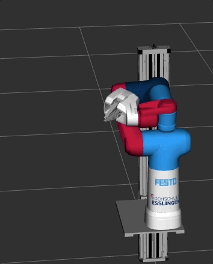

# Simple IK / FK demo with Python

This demo serves as a reference for the usage of the MoveIt2 Python API.

## Running the IK demo

Launch the rviz demo
```
ros2 launch demo rviz_demo_launch.py
```
In a separate terminal run:
```
ros2 run py_demo simple_ik_fk
```


<br/>

**Note: the OMPL planner does not always find a solution. If planning fails, re-run the demo, increase the goal tolerance or adapt your pose_goal.**