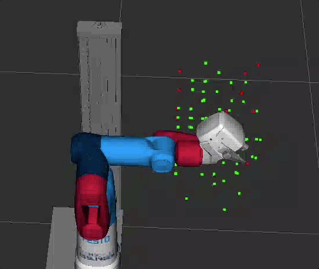
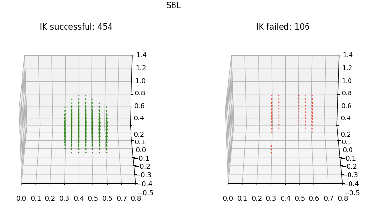

# Simple IK / FK demo with Python

This demo serves as a reference for the usage of the MoveIt2 Python API and the different TCP frames defined in the model.
For the the C++ pendant: check out the `demo` package.

## Running the IK demo

Launch the rviz demo
```
ros2 launch demo rviz_demo_launch.py
```
In a separate terminal run:
```
ros2 run py_demo simple_ik_fk
```


<br/>

**Note: the OMPL planner does not always find a solution. If planning fails, re-run the demo, increase the goal tolerance or adapt your pose_goal.**

## Searching for an Inverse Kinematic Reachable Set

In order to figure out if a planner config works on an operation domain, launch launch the rviz demo
```
ros2 launch demo rviz_demo_launch.py
```

and run
```
ros2 run py_demo ik_reachable_set
```

Add a Marker into rviz and subscribe to `/points_marker_topic`. Cartesian points with an IK solution are displayed in green, points with no solution are displayed in red.

The search is randomized => we feed random (xyz) coordinates to the planner. This makes the IK search a bit harder since we make sure that all points are accessible (regardless the origin of the search).



You can define the preferred Planner, the bounding box for the search as well as the resolution.

The results can be stored in pickles and post-processed. Example:

